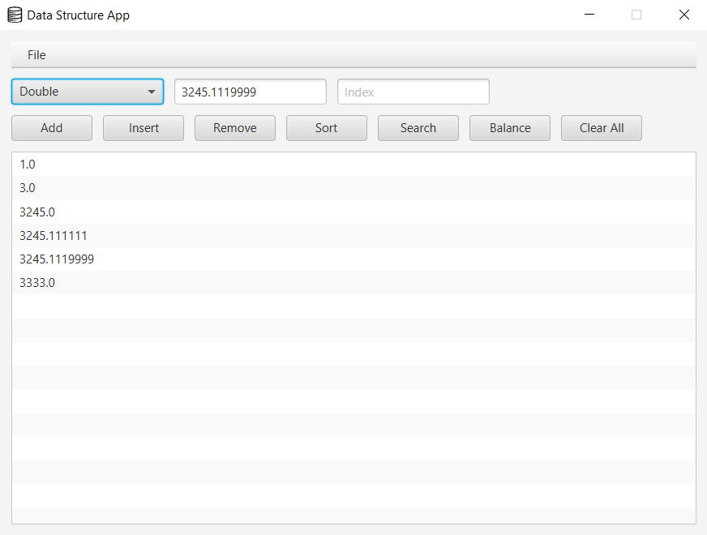
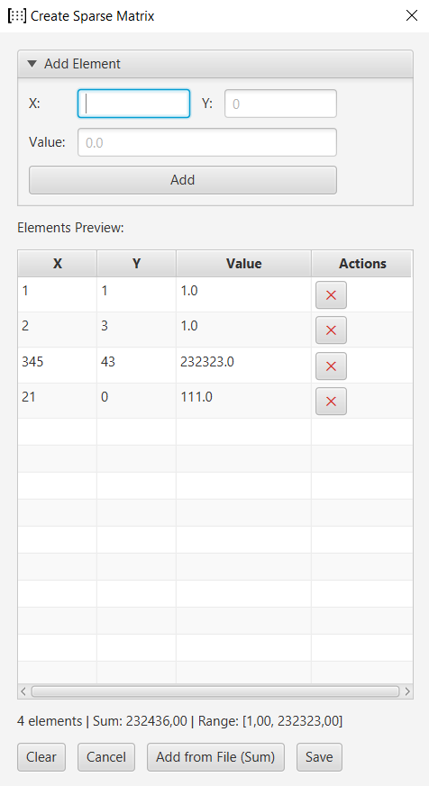
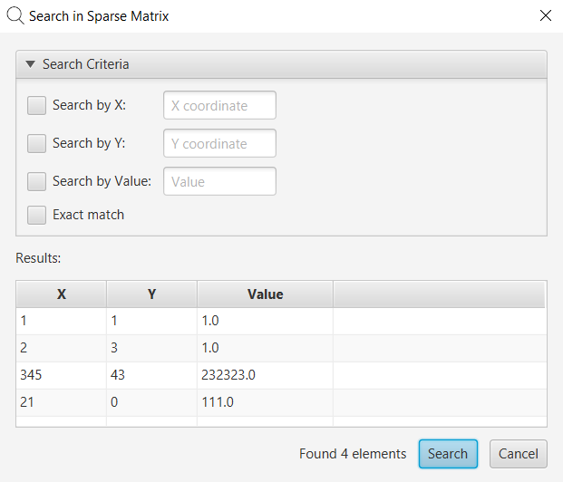

# MultiList Data Structure — Java to Scala and Kotlin Port

## Description

This project is a port of a data structure application from Java to Scala and Kotlin developed as part of university laboratory work.

The application implements a custom data structure based on a list containing list headers (`MultiList`) with support for multiple user-defined data types and graphical user interface interaction.

The project demonstrates:

- porting object-oriented Java code to Scala;
- usage of Scala traits and collections;
- porting object-oriented Java code to Kotlin;
- combination of imperative and functional programming approaches;
- implementation of generic data handling through interfaces/traits;
- work with serialization and file storage;
- integration between Scala (or Kotlin) backend and JavaFX GUI.

The application supports the following data types:

- Integer
- Double
- String
- Sparse Matrix

Each structure instance stores elements of only one selected type.


 

---

## Implemented Features

### Data Structure Operations

- add element
- insert by index
- get by index
- remove by index
- clear structure
- iteration with callback
- search with predicate
- balancing
- sorting

### Sorting

Merge Sort was implemented in two styles:

- functional recursive implementation;
- imperative iterative implementation.

The sorting algorithm complexity is `O(n log n)`.

### Sparse Matrix

A sparse matrix implementation is included with:

- coordinate-based storage;
- matrix addition;
- serialization/deserialization;
- comparison operations.

### Serialization

The application supports saving and loading data in:

- TXT
- JSON
- XML
- BIN

### GUI

The graphical interface was implemented using JavaFX.

The GUI allows:

- selecting a data type;
- editing structure contents;
- performing all supported operations;
- saving/loading files;
- editing sparse matrices through a dedicated editor.

---

## Technologies

- Scala
- Kotlin
- Java
- JavaFX
- Gradle

---

## Project Structure

```
src/
 ├── main/
 │    ├── java/
 │    ├── kotlin/
 │    └── scala/
```

Main Scala and Kotlin components:

- `MultiList` — custom data structure
- `UserType` — abstraction for user-defined types
- `Comparator` — comparison interface
- `UserTypeFactory` — factory for type registration
- `SparseMatrix` — sparse matrix implementation

Java components are mainly responsible for:

- JavaFX GUI
- controllers
- event handling
- serialization infrastructure

---

## Running the Project

### Requirements

Installed software:

- JDK 21+ (or version used in the project)
- Gradle

### Run application

Using Gradle:

```
gradle clean run
```

or using Gradle Wrapper:

```
./gradlew clean run
```

On Windows:

```
gradlew.bat clean run
```

Usually `clean` is optional, but it is useful before the first launch or after changing project configuration.
